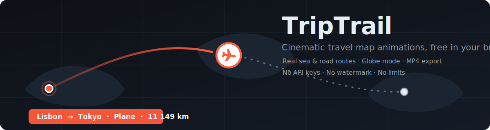

<p align="center">
  
</p>

<h1 align="center">TripTrail</h1>

<p align="center">
  Turn any trip into a cinematic animated map video — right in your browser.<br/>
  A free, no-watermark, no-API-key travel map animation studio.
</p>

<p align="center">
  <a href="https://travel-map-animator.vercel.app"><b>▶&nbsp;&nbsp;Live demo — travel-map-animator.vercel.app</b></a>
</p>

<p align="center">
  <a href="https://travel-map-animator.vercel.app"></a>
  <a href="https://developer.mozilla.org/en-US/docs/Web/JavaScript"></a>
  <a href="https://maplibre.org"></a>
  <a href="LICENSE"></a>
</p>

---

## 🎬 Demo

<p align="center">
  
</p>

<p align="center">
  <a href="assets/demo.mp4"><b>▶&nbsp;&nbsp;Watch the full demo video</b></a> — a 17-stop round-the-world trip, rendered offline at constant fps by the in-browser engine (1080p60 source).
</p>

## ✨ Features

|  | |
|---|---|
| 🗺️ **Build routes 3 ways** | Search cities, click the map, or type "Lisbon to Madrid by train, then Barcelona by car" (English & 中文) |
| 🚄 **10 transport modes** | Plane, train, car, bus, boat, bike, walk, camper, motorcycle, tuk-tuk — all with hand-drawn vector icons |
| 🌊 **Real sea lanes** | Boats follow the global shipping network (Eurostat SeaRoute + Dijkstra) — through the Strait of Hormuz, not across it |
| 🛣️ **Real roads & rail corridors** | Cars/buses via OSRM; trains follow ground corridors up to 3 000 km |
| ✈️ **True great circles** | Long flights curve toward the poles and cross the antimeridian correctly — Tokyo → LA flies the Pacific |
| 🌍 **Globe mode** | MapLibre v5 globe projection with camera-accurate far-side occlusion |
| 🎬 **MP4 export** | Native H.264 + AAC via MediaRecorder (WebM too), standard or 2× quality, optional background music mixed into the track |
| 📷 **Photos & titles** | Polaroid pop-ups per stop, intro title card, lower-third captions, custom accent color |
| 📂 **Import** | GPX / KML / GeoJSON with per-stop `mode` — try the bundled [`demo-journey.geojson`](demo-journey.geojson), a 17-stop round-the-world trip |
| 🧈 **Butter-smooth recording** | Every tile along the route is prewarmed before the first frame is captured |

## 🚀 Quick start

**Online:** open the [live demo](https://travel-map-animator.vercel.app), press **▶ Preview**, then **⏺ Record video**.

**Locally** — it's a static site, any server works:

```bash
git clone https://github.com/Fangyuan025/triptrail.git
cd triptrail
python3 -m http.server 8742
# open http://localhost:8742
```

## 🧭 How it works

1. **Plan** — stops are geocoded with Nominatim; each leg picks a routing engine by transport mode: OSRM for ground, a Dijkstra search over the SeaRoute marine network for boats, great-circle interpolation for long flights.
2. **Prewarm** — the camera silently sweeps the whole route once so every map tile is cached.
3. **Animate** — a canvas compositor layers the WebGL map with pins, labels, the moving transport marker, captions and photo cards at 30 fps.
4. **Record** — `canvas.captureStream()` feeds MediaRecorder; the download is a clean MP4 with no watermark.

## 🙏 Free data & tools

| What | Source |
|---|---|
| Map tiles | [OpenFreeMap](https://openfreemap.org) · [VersaTiles](https://versatiles.org) · [CARTO](https://carto.com) |
| Geocoding | [Nominatim](https://nominatim.org) (OpenStreetMap) |
| Road routing | [OSRM](https://project-osrm.org) demo server |
| Shipping lanes | [Eurostat SeaRoute](https://github.com/eurostat/searoute) marine network |
| Rendering | [MapLibre GL JS](https://maplibre.org) v5 |

Map data © OpenStreetMap contributors.

## 📄 License

[MIT](LICENSE) © 2026 Fangyuan Lin
